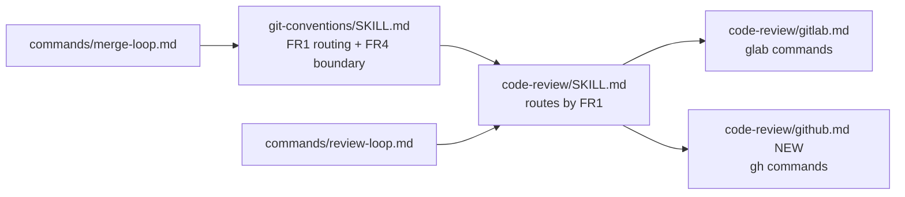

# gh-cli-integration — Design Doc

## Context

The ni plugin drives forge work through `glab` only. [`skills/code-review/gitlab.md`](../../../skills/code-review/gitlab.md) holds every platform command, and [`commands/review-loop.md`](../../../commands/review-loop.md) plus [`commands/merge-loop.md`](../../../commands/merge-loop.md) are hard-wired to GitLab (`argument-hint: "[gitlab project path or URL]"`, `glab` in every step). No file mentions `gh`, and no rule tells an agent which platform a repository is on.

Two problems follow:
1. GitHub repositories get no forge support at all.
2. Agents mix `git` and forge commands because no rule states which operations belong to which tool. Investigation found six mixing points: no MR/PR-create flow (the description ends at `clip.exe`, [`git-conventions/SKILL.md:99`](../../../skills/git-conventions/SKILL.md)), rebase reachable both server-side ([`merge-loop.md:27-28`](../../../commands/merge-loop.md)) and locally (colliding with the no-force rule, [`git-conventions/SKILL.md:29`](../../../skills/git-conventions/SKILL.md)), ambiguous diff source for reviews ([`review-loop.md:16`](../../../commands/review-loop.md) vs [`gitlab.md:45`](../../../skills/code-review/gitlab.md)), the push rule duplicated in three files with differing wording, `glab`'s implicit current-branch MR lookup undocumented, and a `doc:`/`docs(` commit-type mismatch.

Goal: add a GitHub integration mirroring the glab one, and write down the git-versus-forge boundary so agents stop improvising.

## Functional Requirements

### FR1 — Platform routing rule
One rule, owned by [`git-conventions`](../../../skills/git-conventions/SKILL.md), tells the agent which forge CLI a repository uses: read the origin host (`git remote get-url origin`), map `github.com` (and GHES hosts) to `gh` and `gitlab.*` to `glab`, allow an explicit argument or user statement to override, and ask the user when the host matches neither. Skills and commands reference this rule instead of restating it. See [ADR: platform-detection](./adrs/platform-detection.md).

### FR2 — GitHub review reference file
[`skills/code-review/github.md`](../../../skills/code-review/github.md) mirrors [`gitlab.md`](../../../skills/code-review/gitlab.md) section for section: reading PRs and review threads, diff, suggestion syntax, posting replies, resolving threads, verifying, setup and auth. Where GitHub has no CLI verb, the file gives the `gh api` (REST or GraphQL) call, exactly as [`gitlab.md`](../../../skills/code-review/gitlab.md) does for thread resolution. Known capability gaps are stated, not hidden. [`code-review/SKILL.md`](../../../skills/code-review/SKILL.md) routes to the right reference file via FR1 and its description names GitHub and `gh`.

### FR3 — Platform-agnostic loops
[`commands/review-loop.md`](../../../commands/review-loop.md) and [`commands/merge-loop.md`](../../../commands/merge-loop.md) name no forge CLI. They describe the flow in platform-neutral terms (list changes awaiting me, check gates, merge, update branch), route via the FR1 rule, and defer every platform command to a per-platform reference file. The argument hints say "project path or URL". Platform specifics live in the owning skill's reference files: review threads in [`code-review/gitlab.md`](../../../skills/code-review/gitlab.md)/[`github.md`](../../../skills/code-review/github.md), MR/PR lifecycle (create, gates, merge, rebase or branch update, CI status) in [`git-conventions/gitlab.md`](../../../skills/git-conventions/gitlab.md)/[`github.md`](../../../skills/git-conventions/github.md). See [ADR: platform-reference-files](./adrs/platform-reference-files.md).

### FR4 — Git-versus-forge boundary
[`git-conventions`](../../../skills/git-conventions/SKILL.md) states which tool owns which operation. Forge CLI (`gh`/`glab`) owns everything that lives on the server: MR/PR create and description, MR/PR diff, threads, approvals, CI status, merge, server-side rebase or branch update. `git` owns only local state: stage, commit, branch, local diff, log, worktrees, push. The MR/PR description flow becomes `glab mr create/update --description` or `gh pr create/edit --body`, replacing the `clip.exe` clipboard step. The rebase rule says: rebase through the forge, never locally, which resolves the collision with the no-force rule. See [ADR: forge-first-boundary](./adrs/forge-first-boundary.md).

### FR5 — Consistency fixes
Small documented defects fixed in the same change (user decision, 2026-09-28):
- Commit type: [`git-conventions/SKILL.md:77`](../../../skills/git-conventions/SKILL.md) defines `doc:`; the [`plan`](../../../skills/plan/SKILL.md) skill ([`skills/plan/SKILL.md:241,334`](../../../skills/plan/SKILL.md)) and actual history use `docs(...)`. Fix direction: `doc:` becomes `docs:`, matching Conventional Commits and existing usage.
- Portability: [`code-review/gitlab.md:107-108`](../../../skills/code-review/gitlab.md) hard-codes `~/.local/bin/glab` and `--hostname gitlab.com`. Fix direction: drop the binary path; keep the login guidance with the hostname as an example, not a constant.
- Push rule single owner: after tasks 1–2, restatements remain at [`code-review/SKILL.md:30`](../../../skills/code-review/SKILL.md) ("push on request" parenthetical) and `:179` ("Push only on explicit request"). Fix direction: pointers only; the rule text lives once, in [`git-conventions/SKILL.md:57`](../../../skills/git-conventions/SKILL.md).
- Link lint enforcement: the [`plan`](../../../skills/plan/SKILL.md) skill states the cross-referencing rule ("every reference must be a clickable link") with no mechanical check, which is how this workspace shipped 88 unlinked references. Fix direction: add the link lint command to the Phase 4c pre-flight checklist so the gate fails on unlinked references (user decision, 2026-09-28).

## Non-Functional Requirements

### NFR1 — Plugin validates
- **Scenario**: repository state after every task → plugin manifest and skills remain valid
- **Measure**: `claude plugin validate .` exits 0 per task. `--strict` fails today only because the workspace resume anchor (root [`CLAUDE.md`](../../../CLAUDE.md)) triggers a root-context warning; the file is deleted at Phase 6, so the release gate is `claude plugin validate . --strict` after workspace teardown.
- **Verify**: `claude plugin validate .` (per task); `claude plugin validate . --strict` (release gate)

### NFR2 — Size and description limits
- **Scenario**: new and edited skill files → ni conventions hold
- **Measure**: every [`SKILL.md`](../../../skills/) and reference file under 300 lines; every frontmatter description under 1024 characters
- **Verify**: `awk 'END{exit NR>=300}' skills/code-review/github.md && awk 'END{exit NR>=300}' skills/code-review/SKILL.md && awk 'END{exit NR>=300}' skills/git-conventions/SKILL.md`

### NFR3 — No clipboard, no platform leak
- **Scenario**: after FR3/FR4 → no Windows-only or single-platform residue in the touched files
- **Measure**: zero hits for `clip.exe` in skills/ and commands/; zero hits for `gitlab project path` in commands/; zero forge CLI invocations (`glab `/`gh `) in the two loop commands
- **Verify**: `! grep -rn "clip.exe" skills/ commands/ && ! grep -rin "gitlab project path" commands/ && ! grep -En "(glab|gh) " commands/review-loop.md commands/merge-loop.md`

### NFR4 — Command parity
- **Scenario**: every `glab` capability used by the plugin → a `gh` counterpart or a documented gap in [`github.md`](../../../skills/code-review/github.md)
- **Measure**: parity checklist in the FR2 task covers all 10 capability rows (list, view threads, structured notes, diff, suggestion, reply, new inline thread, resolve, verify, auth)
- **Verify**: `manual: parity is a semantic property; the FR2 task carries the checklist as acceptance criteria`

## Non-goals

- **Live end-to-end test against a real GitHub PR.** Requires an authenticated `gh` and a disposable repository; deferred to first real use. Command syntax is verified against `gh` help output during implementation instead.
- **Other forges (Bitbucket, Gitea, Codeberg).** No current need; the FR1 routing rule leaves room (unknown host → ask).
- **Shrinking [`skills/plan/SKILL.md`](../../../skills/plan/SKILL.md) under the 300-line limit** (350 lines today, over the [meta-skill](../../../skills/skill/SKILL.md)'s own rule). Needs restructuring into a reference file — a separate change request. The other small defects found during analysis were promoted to [FR5](#fr5) (user decision, 2026-09-28).

## Rabbit holes

- **GitHub review-thread API.** `gh` has no thread verbs; threads live in GraphQL (`reviewThreads`, `resolveReviewThread`). Cap: use the known GraphQL queries and REST reply endpoint, verify shape against `gh api` docs, do not build pagination beyond `first: 100`.
- **GHES host detection.** Arbitrary GitHub Enterprise hostnames cannot be enumerated. Cap: `github.com` plus `gh auth status` hosts; otherwise the unknown-host rule (ask) applies.
- **Merge-gate semantics mapping.** GitLab's `detailed_merge_status` has no exact GitHub twin. Cap: map to the three GitHub fields (`mergeStateStatus`, `reviewDecision`, `statusCheckRollup`) and keep the loop's conservative rule — skip when not clean, never bypass a gate.

## Failure modes

| Failure | Detection | Response | Blast radius |
|---|---|---|---|
| Forge CLI missing or unauthenticated | `gh auth status` / `glab auth status` non-zero | stop, tell the user the exact login command; never create or read tokens | single command run |
| Origin host matches neither forge | FR1 host mapping falls through | ask the user which forge; never guess | routing decision |
| Repository has no origin remote | `git remote get-url origin` fails | ask the user for the project path or URL | routing decision |
| GraphQL thread mutation rejected (permissions) | `gh api graphql` non-zero | report the thread id and error; leave the thread unresolved; continue with the next | one thread |
| PR not mergeable on GitHub | `mergeStateStatus` not `CLEAN` | skip and report, mirror of the GitLab `detailed_merge_status` gate | one PR |

## Design

Text-only change: three skills/commands edited, one file added. No code, no persistence.

Ownership after the change (one rule, one owner):
- Routing rule and git/forge boundary: [`git-conventions/SKILL.md`](../../../skills/git-conventions/SKILL.md), tool-name level only (FR1, FR4).
- MR/PR lifecycle commands per platform: [`git-conventions/gitlab.md`](../../../skills/git-conventions/gitlab.md) and [`git-conventions/github.md`](../../../skills/git-conventions/github.md) (FR4, FR3).
- Review flow: [`code-review/SKILL.md`](../../../skills/code-review/SKILL.md); review-thread commands per platform: [`code-review/gitlab.md`](../../../skills/code-review/gitlab.md) / [`code-review/github.md`](../../../skills/code-review/github.md) (FR2).
- Loop orchestration: the two command files, platform-agnostic, no forge CLI named (FR3).

No trust boundary crosses inside the plugin: the forge CLIs hold the credentials. The auth sections keep the existing rule — check status, never create or read tokens.

Decisions:
- [Which GitHub CLI](./adrs/github-cli-choice.md)
- [Platform detection](./adrs/platform-detection.md)
- [Git-versus-forge boundary](./adrs/forge-first-boundary.md)
- [Platform reference files](./adrs/platform-reference-files.md) — commands stay agnostic; per-platform `.md` files carry the commands

## Data & migration

N/A: markdown-only change, no persistence.

## Cross-cutting Concerns

Rollout: version bump in [`.claude-plugin/plugin.json`](../../../.claude-plugin/plugin.json) and [README](../../../README.md) tables updated — nothing else (user decision, 2026-09-28: no tagging or release mechanics in this change). Validation stays `claude plugin validate .`. Rollback: git revert of the release commit.
