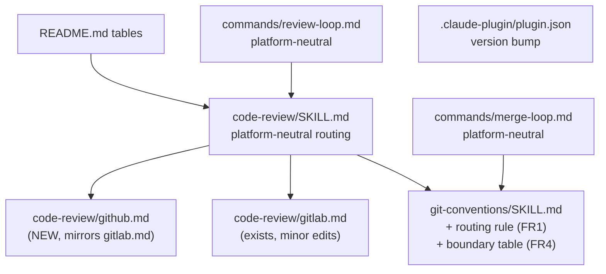

# gh-cli-integration — Tasks

Design: [DESIGN.md](./DESIGN.md)

## Analysis

Build: N/A — markdown-only plugin, nothing compiles
Test: `claude plugin validate .` — verified green (exit 0; one warning from the transient workspace `CLAUDE.md`, see [NFR1](./DESIGN.md#nfr1))
Lint: N/A — no linter configured in this repository

Environment constraints discovered:
- Neither `gh` nor `glab` is installed in this worktree environment (`which gh glab` finds nothing; `~/.local/bin` holds only `claude`). Live command verification is impossible here; `gh` syntax is written from documented behaviour and flagged `manual` where a live check would be needed.
- `claude plugin validate . --strict` fails only on the workspace `CLAUDE.md` root-context warning; the strict gate moves to Phase 6 after workspace teardown.

### Known-failing tests
| Test | Reason | Action |
|---|---|---|
| `claude plugin validate . --strict` | Transient workspace `CLAUDE.md` at plugin root | Run strict only at Phase 6, after the workspace file is deleted |

### Domain model

The domain is instruction files, not code. Boxes are files; edges are markdown links.

### Requirement traceability

| Artifact | Stability | Addresses | Notes |
|---|---|---|---|
| `git-conventions/SKILL.md` routing rule | published | [FR1](./DESIGN.md#fr1) | Other skills link it by anchor; keep the anchor stable |
| `git-conventions/SKILL.md` boundary table | published | [FR4](./DESIGN.md#fr4) | Single owner of the git/forge split |
| `code-review/github.md` | published | [FR2](./DESIGN.md#fr2) | File name is a link target from SKILL.md and git-conventions; content internal |
| `git-conventions/gitlab.md` | published | [FR3](./DESIGN.md#fr3), [FR4](./DESIGN.md#fr4) | MR lifecycle commands; link target for the loop commands ([ADR](./adrs/platform-reference-files.md)) |
| `git-conventions/github.md` | published | [FR3](./DESIGN.md#fr3), [FR4](./DESIGN.md#fr4) | PR lifecycle commands; same rule |
| `code-review/SKILL.md` description + routing lines | published | [FR1](./DESIGN.md#fr1), [FR2](./DESIGN.md#fr2) | Description drives skill triggering; compatibility rule: only add triggers, never remove GitLab ones |
| `commands/review-loop.md` | published | [FR3](./DESIGN.md#fr3) | Invoked as `/ni:review-loop`; argument shape must stay backward compatible |
| `commands/merge-loop.md` | published | [FR3](./DESIGN.md#fr3) | Invoked as `/ni:merge-loop`; same rule |
| `code-review/gitlab.md` edits | internal | [FR4](./DESIGN.md#fr4) | Trim duplicated push rule to a pointer |
| `README.md` table rows | internal | [FR2](./DESIGN.md#fr2), [FR3](./DESIGN.md#fr3) | |
| `plugin.json` version | published | rollout | Semver minor bump: new capability, no breaking change |

### Instruction invariants (transformations)

The "functions" here are rules the edited files must encode. Each row becomes a grep-checkable or review-checkable assertion.

| Rule | Where | Invariant |
|---|---|---|
| Platform routing | `git-conventions` | argument/user override → origin host → auth-host fallback → ask; never guess ([ADR](./adrs/platform-detection.md)) |
| Boundary | `git-conventions` | Server-side operations name only `gh`/`glab`; local operations name only `git` ([ADR](./adrs/forge-first-boundary.md)) |
| Boundary, error path | `git-conventions` | Unknown origin host or missing remote → ask the user (DESIGN failure modes) |
| Description flow | `git-conventions` | MR/PR description goes through `glab mr create/update` / `gh pr create/edit`; zero `clip.exe` |
| Rebase | `git-conventions` + `merge-loop` | Rebase/update of a pushed branch through the forge only; no local rebase + force |
| Auth, error path | `github.md` | `gh auth status` fails → tell the user the login command; never create or read tokens |
| Thread resolve, error path | `github.md` | GraphQL mutation fails → report thread id and error, continue with next thread |
| Merge gate, neutral | `merge-loop` | Merge only when the platform reports mergeable, approved, not draft; never bypass a gate; no platform field named |
| Merge gate, per platform | `git-conventions/<platform>.md` | GitLab: `detailed_merge_status == mergeable`; GitHub: `mergeStateStatus == CLEAN` and `reviewDecision == APPROVED` |
| Platform agnosticism | `commands/*.md` | Zero `glab`/`gh` invocations in loop commands ([ADR](./adrs/platform-reference-files.md)) |
| One owner | all touched files | Push/no-force rule stated once in `git-conventions`; elsewhere pointers only |

## Tasks

### 1. Routing rule and forge boundary in git-conventions ([FR1](./DESIGN.md#fr1), [FR4](./DESIGN.md#fr4))
**Goal**: give every skill one place that answers "which tool for this operation, which forge for this repository".
**Artifacts**: `skills/git-conventions/SKILL.md`
**Constraints**:
- [ADR: platform-detection](./adrs/platform-detection.md) — override → origin host → auth-host fallback → ask; never guess
- [ADR: forge-first-boundary](./adrs/forge-first-boundary.md) — encode the operation table verbatim in intent
- Replace the clip.exe description flow (lines 93–99) with forge-CLI create/edit commands
- Keep existing commit rules (types, message format, no amend, no force, push on request) untouched
- Stay under 300 lines; lite terse voice per the `ni:skill` conventions
**Tests** (red before the edit):
- `grep -q "clip.exe" skills/git-conventions/SKILL.md` currently succeeds — must fail after
- `grep -qi "github" skills/git-conventions/SKILL.md` currently fails — must succeed after
**Verify**: `! grep -q "clip.exe" skills/git-conventions/SKILL.md && grep -qi "github" skills/git-conventions/SKILL.md && grep -q "remote get-url origin" skills/git-conventions/SKILL.md && awk 'END{exit NR>=300}' skills/git-conventions/SKILL.md && claude plugin validate .`
**Acceptance criteria**:
- [x] Routing rule present with the three-step order and an anchor other files can link
- [x] Boundary table present: local operations `git` only, server operations forge only, rebase forge-only stated
- [x] MR/PR description flow uses `glab mr create/update` and `gh pr create/edit`; `clip.exe` gone
- [x] Verify command exits 0
**Depends on**: (none)
**Time-box**: ~45 min

### 2. Write code-review/github.md and reroute code-review/SKILL.md ([FR2](./DESIGN.md#fr2), [NFR4](./DESIGN.md#nfr4))
**Goal**: GitHub reviews get the same reference support GitLab has.
**Artifacts**: `skills/code-review/github.md` (new), `skills/code-review/SKILL.md`, `skills/code-review/gitlab.md` (pointer trim)
**Constraints**:
- [ADR: github-cli-choice](./adrs/github-cli-choice.md) — `gh` only; threads via `gh api graphql`; replies via the REST replies endpoint
- Mirror `gitlab.md` section order: Reading, Suggestion syntax, Posting after approval (reply → resolve → verify), Setup
- Parity checklist (all 10 rows): list PRs for review / own PRs, view open threads, structured thread JSON, diff + refs, suggestion syntax, reply in thread, new inline thread, resolve, verify resolution, auth
- GitHub suggestion blocks have no `:-N+M` range modifier — document the difference explicitly
- `SKILL.md` description gains GitHub/`gh`/PR triggers, keeps every GitLab trigger, stays under 1024 characters
- Routing line points to the `git-conventions` routing rule (task 1 anchor), then to `gitlab.md`/`github.md`
- Scratch-file naming (`mr-<iid>-suggestions.md`, SKILL.md:236) becomes platform-neutral
- `gitlab.md:13-14` push wording becomes a pointer to `git-conventions`
**Tests** (red before the edit):
- `test -f skills/code-review/github.md` currently fails — must pass after
- `grep -q "github.md" skills/code-review/SKILL.md` currently fails — must pass after
**Verify**: `test -f skills/code-review/github.md && grep -q "github.md" skills/code-review/SKILL.md && grep -q "resolveReviewThread" skills/code-review/github.md && grep -q "gh auth status" skills/code-review/github.md && awk 'END{exit NR>=300}' skills/code-review/github.md && awk 'END{exit NR>=300}' skills/code-review/SKILL.md && claude plugin validate .`
**Acceptance criteria**:
- [x] All 10 parity rows present in `github.md`, each with a command or a stated gap
- [x] `gh` syntax flagged `manual: no gh binary in this environment` where only a live call could prove it
- [x] Description under 1024 characters with GitHub triggers added and GitLab triggers intact
- [x] Verify command exits 0
**Depends on**: task 1
**Time-box**: ~75 min

### 3. Platform-neutral review-loop ([FR3](./DESIGN.md#fr3))
**Goal**: `/ni:review-loop` works on GitHub PRs.
**Artifacts**: `commands/review-loop.md`
**Constraints**:
- [ADR: platform-reference-files](./adrs/platform-reference-files.md) — the command names no forge CLI; every platform command defers to `code-review/gitlab.md`/`github.md` (threads, listing) or `git-conventions/gitlab.md`/`github.md` (lifecycle)
- Routing via the task 1 rule; argument hint becomes "project path or URL"
- Steps written platform-neutral: "list changes awaiting my review", "skip already-approved ones", "post findings as discussions" — reference files supply the commands
- Diff-source ambiguity (review-loop.md:16) resolved by pointing at the boundary rule: forge diff for MR/PR review
**Tests** (red before the edit): `grep -qi "gitlab project path" commands/review-loop.md` currently succeeds — must fail after; `grep -E "(glab|gh) " commands/review-loop.md` currently succeeds — must fail after.
**Verify**: `! grep -qi "gitlab project path" commands/review-loop.md && ! grep -E "(glab|gh) " commands/review-loop.md && grep -q "github.md" commands/review-loop.md && claude plugin validate .`
**Acceptance criteria**:
- [x] No forge CLI named in the command file; every step points to a reference file
- [x] Verify command exits 0
**Depends on**: task 1, task 2
**Time-box**: ~40 min

### 4. Platform-neutral merge-loop ([FR3](./DESIGN.md#fr3))
**Goal**: `/ni:merge-loop` works on GitHub PRs.
**Artifacts**: `commands/merge-loop.md`
**Constraints**:
- [ADR: platform-reference-files](./adrs/platform-reference-files.md) — the command names no forge CLI and no platform-specific field; gates, merge, auto-merge, cancel, and branch update defer to `git-conventions/gitlab.md`/`github.md`
- Neutral gate rule stated once: merge only when the platform reports the change mergeable and approved and not draft; never bypass a failing gate
- Branch update through the forge only; no local rebase (task 1 boundary)
- Platform specifics (`detailed_merge_status`, `mergeStateStatus`, `reviewDecision`, cancel API, `update-branch`) live in the task 1 reference files — verify they are present there
**Tests** (red before the edit): `grep -qi "gitlab project path" commands/merge-loop.md` currently succeeds — must fail after; `grep -E "(glab|gh) " commands/merge-loop.md` currently succeeds — must fail after.
**Verify**: `! grep -qi "gitlab project path" commands/merge-loop.md && ! grep -E "(glab|gh) " commands/merge-loop.md && grep -q "github.md" commands/merge-loop.md && grep -q "mergeStateStatus" skills/git-conventions/github.md && grep -q "update-branch" skills/git-conventions/github.md && claude plugin validate .`
**Acceptance criteria**:
- [x] No forge CLI or platform-specific field named in the command file
- [x] Neutral gate rule intact; platform gates present in the git-conventions reference files
- [x] Verify command exits 0
**Depends on**: task 1
**Time-box**: ~45 min

### 5. Consistency fixes ([FR5](./DESIGN.md#fr5))
**Goal**: fix the small documented defects promoted from non-goals by the user.
**Artifacts**: `skills/git-conventions/SKILL.md`, `README.md`, `skills/code-review/gitlab.md`, `skills/code-review/SKILL.md`
**Constraints**:
- Commit type: `doc:` becomes `docs:` at `git-conventions/SKILL.md:77` (Conventional Commits and actual history win); `plan/SKILL.md` stays untouched
- Portability: `code-review/gitlab.md:107-108` drops the `~/.local/bin/glab` path; login guidance keeps `--hostname gitlab.com` as an example only
- Push rule one owner: `code-review/SKILL.md:30` parenthetical and `:179` restatement become pure pointers to `git-conventions`; the rule text appears once in the repo (`git-conventions/SKILL.md:57`)
**Tests** (red before the edit):
- `grep -q "\`doc:\`" skills/git-conventions/SKILL.md` currently succeeds — must fail after
- `grep -q "local/bin/glab" skills/code-review/gitlab.md` currently succeeds — must fail after
**Verify**: `grep -q "docs:" skills/git-conventions/SKILL.md && ! grep -q "\`doc:\`" skills/git-conventions/SKILL.md && ! grep -q "local/bin/glab" skills/code-review/gitlab.md && ! grep -qi "push only on explicit request" skills/code-review/SKILL.md && claude plugin validate .`
**Acceptance criteria**:
- [ ] `docs:` type defined; no `doc:` remains
- [ ] No hard-coded binary path; push rule stated once, pointers elsewhere
- [ ] Verify command exits 0
**Depends on**: task 2 (touches the same code-review files)
**Time-box**: ~30 min

### 6. Version bump and README tables ([NFR1](./DESIGN.md#nfr1), [NFR3](./DESIGN.md#nfr3))
**Goal**: version increment and documentation tables only — no tagging or release mechanics (user decision).
**Artifacts**: `README.md`, `.claude-plugin/plugin.json`
**Constraints**:
- Version bump `1.3.2` to `1.4.0` (minor: new capability, no break); nothing else in `plugin.json`
- Every table in README updated where the change touches it: skills table (`ni:code-review` and `ni:git-conventions` rows mention GitHub and platform routing), commands table (loop rows platform-neutral), repo layout table (new reference files), usage examples (`MR !42` wording becomes platform-neutral)
- No `claude plugin tag`, no tag push, no marketplace step
**Tests** (red before the edit): `grep -q '"version": "1.4.0"' .claude-plugin/plugin.json` currently fails — must pass after.
**Verify**: `grep -q '"version": "1.4.0"' .claude-plugin/plugin.json && grep -qi "github" README.md && ! grep -rn "clip.exe" skills/ commands/ && ! grep -rin "gitlab project path" commands/ && ! grep -E "(glab|gh) " commands/review-loop.md commands/merge-loop.md && claude plugin validate .`
**Acceptance criteria**:
- [ ] Version is 1.4.0; all listed README tables updated; verify command exits 0
**Depends on**: tasks 1–5
**Time-box**: ~30 min

## Sessions

### Session 1 — GitHub CLI integration (~4.5H)
Tasks: 1, 2, 3, 4, 5, 6
**Skills**: `skill` (ni conventions for editing skills), `git-conventions` (commits), `evidence-based-analysis` (citations in edited files)
**Checkpoint**: `claude plugin validate . && ! grep -rn "clip.exe" skills/ commands/ && ! grep -rin "gitlab project path" commands/ && ! grep -E "(glab|gh) " commands/review-loop.md commands/merge-loop.md && test -f skills/code-review/github.md && test -f skills/git-conventions/github.md && test -f skills/git-conventions/gitlab.md`
**Commit point**: yes — one commit per task, per the durability invariants

## Quality gates (post-session review)
- [ ] Acceptance criteria: all green above
- [ ] Code review: edits match [DESIGN.md](./DESIGN.md) intent; one rule, one owner preserved
- [ ] Organization: reference files one level deep; links relative; agents referenced by spawn name
- [ ] Quality: no duplicated rules across skills; descriptions trigger-first
- [ ] Security: auth sections instruct status-check only; never create or read tokens; no secrets in examples
- [ ] Observability: N/A — markdown plugin
- [ ] Performance: N/A — markdown plugin
