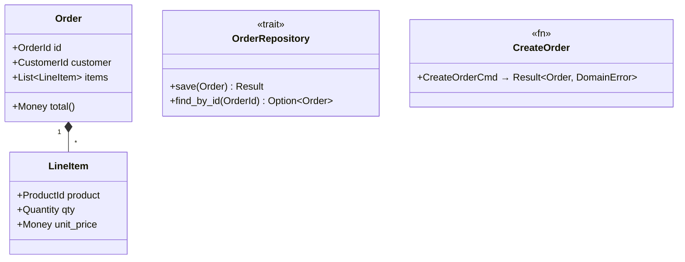

# <NAME> — Tasks

Design: [DESIGN.md](./DESIGN.md)

## Analysis

Build: `<exact build command>` — verified green
Test: `<exact test command>` — verified green
Lint: `<exact lint command>` — verified green

### Known-failing tests
| Test | Reason | Action |
|---|---|---|
| (none — or list pre-existing failures) | | ignore / skip |

### Domain model

### Requirement traceability
| Type / Trait / Fn | Addresses | Notes |
|---|---|---|
| `Order` | [FR1](./DESIGN.md#fr1) | Aggregate root |
| `LineItem` | [FR1](./DESIGN.md#fr1) | Value object, immutable |
| `OrderRepository` | [NFR1](./DESIGN.md#nfr1) | Trait — infra implements |
| `CreateOrder` | [FR2](./DESIGN.md#fr2) | Validates invariants before persisting |

### Transformations
| Function | Input → Output | Invariant / Rule |
|---|---|---|
| `CreateOrder` | `CreateOrderCmd → Result<Order, DomainError>` | At least one line item, total > 0 |
| `Order::total` | `&self → Money` | Sum of (qty × unit_price) per line item |

## Tasks

### 1. Task title ([FR1](./DESIGN.md#fr1), [NFR2](./DESIGN.md#nfr2))
**Goal**: Why this task exists (one sentence).
**Types**: `Order`, `LineItem` — see domain model
**Constraints**: rules the implementation must respect
- [ADR: decision-name](./adrs/decision-name.md) — the constraint from this decision
- Invariant: `Order` must always have at least one `LineItem`
- Transformation: `CreateOrderCmd → Result<Order, DomainError>` must enforce total > 0
**Tests**: what to test before implementing (red → green)
- `test_order_requires_at_least_one_line_item` — creating an Order with empty items returns error
- `test_order_total_sums_line_items` — total equals sum of qty × unit_price
**Verify**: `cargo test -- test_bar && cargo clippy`
**Acceptance criteria**:
- [ ] Criterion 1 (pass/fail, no subjective language)
- [ ] Criterion 2
**Depends on**: (none) | task 2
**Time-box**: ~45 min

## Sessions

Group tasks into autonomous sessions. Each session is a contiguous block of work (target: 2–4H) that ends with a verifiable checkpoint. An agent completes one session, verifies, then proceeds to the next. Minimize the number of sessions — fewer, longer sessions mean fewer interruptions.

### Session 1 — <title> (~2.5H)
Tasks: 1, 2, 3, 4, 5
**Skills**: `software-engineer` (+ language-specific extension for the project)
**Checkpoint**: `<exact command that proves session is complete>`
**Commit point**: yes — commit after checkpoint passes

### Session 2 — <title> (~2H)
Tasks: 6, 7, 8
**Skills**: `software-engineer`
**Checkpoint**: `<exact command>`
**Commit point**: yes

## Quality gates (post-session review)
- [ ] Acceptance criteria: all green above
- [ ] Code review: implementation matches [DESIGN.md](./DESIGN.md) intent
- [ ] Code organization: file placement, module structure, naming conventions (refactoring pass)
- [ ] Code quality: no new complexity, clean types, no duplication
- [ ] Security review: OWASP check, dependency audit, no secrets exposed
- [ ] Observability: relevant metrics identified, dashboards/alerts in place, logging covers key paths
- [ ] Performance: NFR targets met, no regressions on critical paths, load tested if applicable
